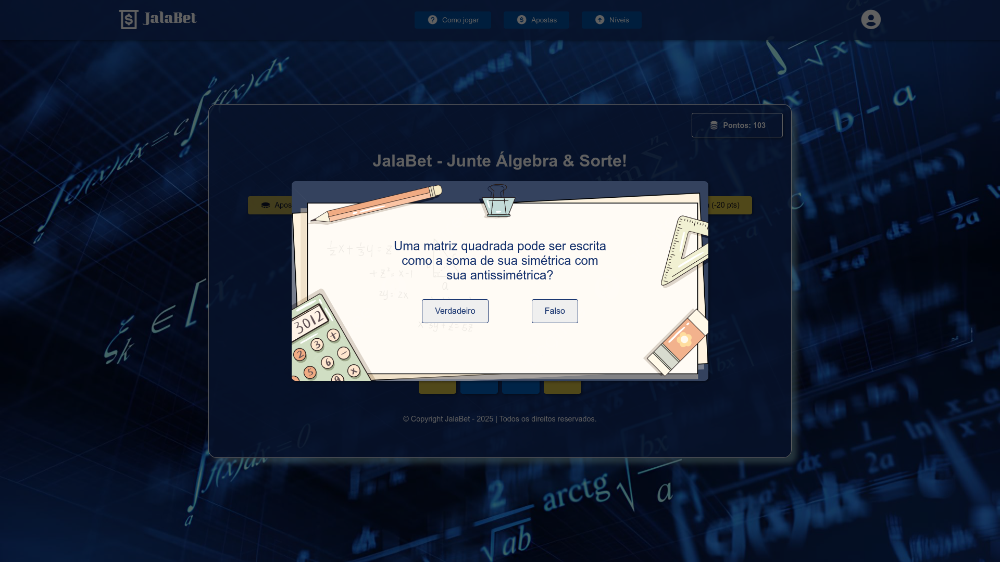
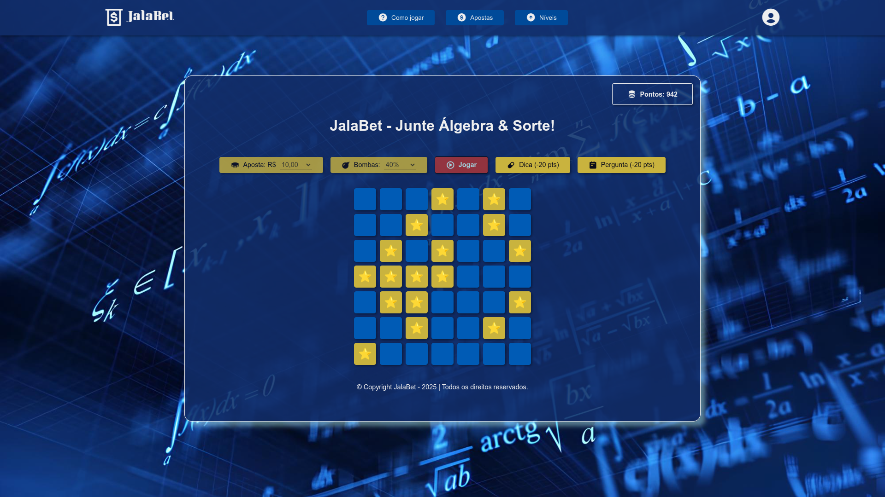
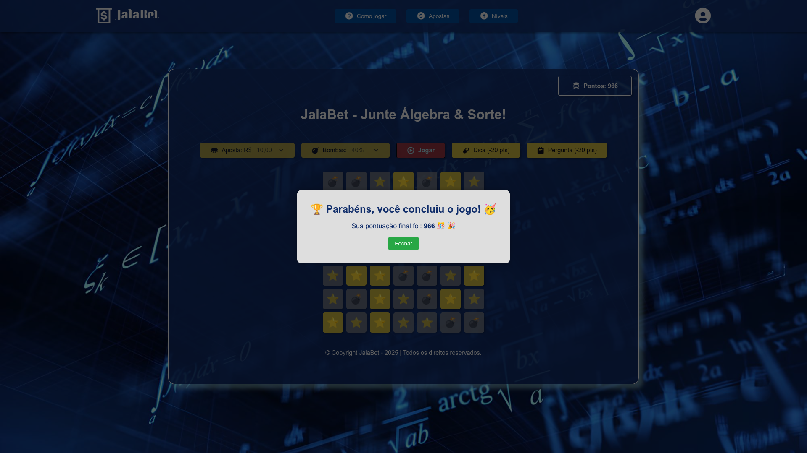
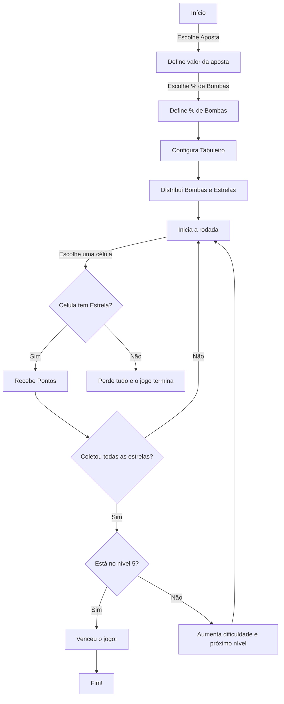

# Jala Bet 🎲💰

Jala Bet é um jogo de apostas **baseado em matrizes e conceitos de álgebra**. O objetivo é testar sua `sorte` e `conhecimento matemático` para avançar pelos níveis e acumular pontos!

---

## 📌 Funcionalidades
- `Tabuleiro dinâmico` representado por uma matriz, com tamanho progressivo de 3x3 até 7x7.
- `Níveis progressivos` com dificuldade crescente, aumentando o número de bombas e o tamanho do tabuleiro.
- `Sistema de pontuação` que considera o valor da aposta, o nível atual e a porcentagem de bombas selecionada.
- `Elementos interativos`, como dicas e perguntas relacionadas a álgebra linear, para auxiliar o jogador.
- `Interface responsiva` que se adapta a diferentes tamanhos de tela.
  
---

## 🖼️ Demonstração




Confira o projeto ao vivo: https://jala-bet.vercel.app

---

## 🚀 Tecnologias Utilizadas
- **HTML5** - Estrutura do jogo.
- **CSS3** - Estilização.
- **JavaScript** - Lógica do jogo e manipulação do DOM.
- **BoxIcons** - Ícones utilizados na interface.
- **Vercel** - Hospedagem do jogo.
- **Git** - Controle de versão.

---

## 🎮 Como Jogar
1. ### Configuração Inicial:
   - Selecione o valor da sua aposta.
   - Escolha a porcentagem de bombas no tabuleiro.
   
2. ### Início do Jogo:
   - Clique em "Jogar" para gerar o tabuleiro.

3. ### Jogabilidade:
   - Clique nas células do tabuleiro para revelá-las.
   - Se encontrar uma estrela (⭐), você ganha pontos.
   - Se encontrar uma bomba (💣), você perde e o jogo termina.

4. ### Progressão:
   - Colete estrelas suficientes para avançar de nível, aumentando a dificuldade e o tamanho do tabuleiro.

5. ### Dicas e Perguntas:
   - Utilize as dicas matemáticas e responda às perguntas de álgebra linear para auxiliar na sua estratégia.
  
---

## 🧮 Conceitos Matemáticos Aplicados (Álgebra Linear)
### ✔ Matrizes e Operações
  - O tabuleiro é representado por uma matriz dinâmica (3×3 até 7×7).
  - Dicas são baseadas na soma de linhas, colunas e diagonais.

### ✔ Vizinhança Segura e Caminho Otimizado
  - Avaliação dos elementos vizinhos para evitar bombas.
  - Algoritmos de busca de melhor rota dentro da matriz.

### ✔ Sistemas Lineares e Determinantes
  - Algumas perguntas abordam soluções de sistemas lineares.
  - Uso de determinantes e propriedades de subespaços vetoriais.

### ✔ Transformações Lineares
  - Parte das perguntas explora multiplicação de matrizes e suas aplicações.

---

## 📂 Estrutura do Projeto
```
jala-bet/
│-- index.html          # Arquivo principal do jogo
│-- css/
│   ├── index.css       # Estilos gerais
│   ├── main.css        # Estilos principais do jogo
│   ├── modais.css      # Estilos para efeitos interativos do jogo
│   ├── medias.css      # Responsividade do jogo
│-- js/
│   ├── jogo.js         # Geração do tabuleiro e mecanismos principais do jogo
│   ├── dicas.js        # Lógica para dicas matemáticas (usando alertas)
│   ├── perguntas.js    # Lógica para perguntas de álgebra (verdadeiro ou falso)
│   ├── modal.js        # Funcionalidades interativas do jogo
│   ├── menu.js         # Responsividade do menu (efeito menu hamburguer)
│-- assets/
│   ├── img/            # Imagens do jogo
│-- README.md           # Documentação
```

---

## 🔀 Fluxograma


---

## 🛠 Como Executar o Projeto
### 1. Clone este repositório:
  ```bash
  git clone https://github.com/vitoriabarbosa/jala-bet.git
  ```

### 2. Acesse a pasta do projeto:
  ```bash
  cd jala-bet
  ```

### 3. Abra o arquivo index.html no navegador.
  

---

## 📀 Melhorias Futuras
- Adicionar mais perguntas e dicas relacionadas a diferentes tópicos de álgebra linear.
- Melhorar efeitos visuais e animações do jogo.

---
